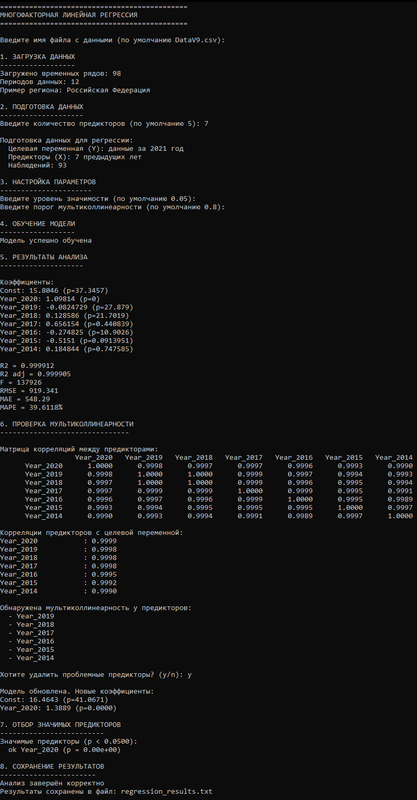

# Многофакторная линейная регрессионная модель (ЛМФМ) для данных внешнеторгового оборота (2010-2021)

---

## Цель работы и постановка задачи
Изучение методов построения и оценки многомерных линейных регрессионных моделей на реальных данных Росстата.

Основные задачи:

-Разработка программного модуля для обработки данных Росстата в формате CSV
-Реализация алгоритма многомерной линейной регрессии с использованием метода наименьших квадратов
-Автоматический отбор значимых факторов и проверка на мультиколлинеарность
-Оценка качества построенной модели с использованием статистических критериев
-Прогнозирование значений для регионов РФ
-Визуализация и сохранение результатов анализа

---

## Краткое описание процедуры построения и оценки ЛМФМ

### 1. Подготовка данных
-Загрузка данных из CSV-файла с разделителем ';'
-Преобразование строковых значений в числовой формат
-Обработка пропущенных значений 
-Формирование матрицы факторов X и вектора отклика y

### 2. Построение модели
Математическая основа:

Модель: $y = \beta_0 + \beta_1x_1 + \beta_2x_2 + ... + \beta_kx_k + \epsilon$

Оценка параметров: $\hat{\beta} = (X^TX)^{-1}X^Ty$

### 3. Отбор значимых факторов
Критерии отбора:

-Уровень значимости α = 0.05
-p-value < α → фактор значим
-Проверка на мультиколлинеарность (корреляция > 0.8)

### 4. Оценка качества модели

Рассчитываются метрики:

- $R^2$ и $R^2_{adj}$ - коэффициент детерминации
- F-статистика — общая значимость модели;
- RMSE — среднеквадратичная ошибка;
- MAE — средняя абсолютная ошибка;
- MAPE — средняя абсолютная процентная ошибка прогноза.

### 5. Прогнозирование
Программа выводит топ-10 регионов по прогнозируемому внешнеторговому обороту на 2021 год

---

## Демонстрация работы программы

### Входные данные

- Данные по внешнеторговому обороту РФ.

**Формат данных:** 

Регион;Код;2010 г.;2011 г.;...;2021 г.

### Запуск программы
Программа реализована на C++ с использованием библиотеки Eigen:

- Выбор файла — ввод `"DataV5.csv"` или выбор из списка;
- Количество факторов — сколько предыдущих периодов использовать (по умолчанию 5);
- Уровень значимости — порог для статистической значимости факторов (по умолчанию 0.05);
- Интерактивный отбор факторов — анализ значимости и мультиколлинеарности;
- Получение результатов — вывод статистики и прогнозов в консоль и сохранение в файл.

### Код программы

**[Основной файл](./ссылка)**

## Результаты работы

### Выходные данные

Результаты автоматически сохраняются в:

**[Файл](./regression_results_v9.txt)**

## Используемые технологии

- Язык программирования: **C++**
- Линейная алгебра: **Eigen**
- Источник данных: **Росстат**
- Формат данных: **CSV**

---

## Итог

Разработанная программа реализует полный цикл многофакторного регрессионного анализа для данных. Модель демонстрирует высокое качество аппроксимации и может использоваться для прогнозирования показателей. Программа гибко настраивается и предоставляет детальную статистику для принятия решений.
